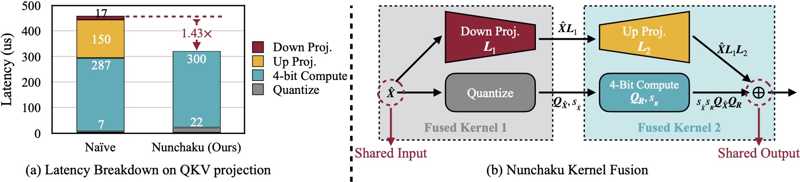
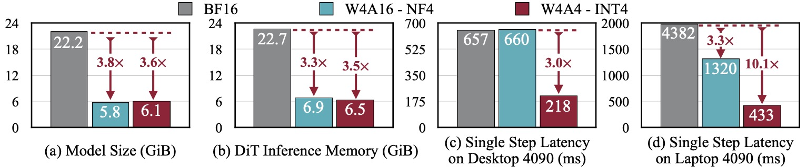

# Nunchaku

Nunchaku is an inference engine designed for 4-bit diffusion models, as demonstrated in our paper [SVDQuant](http://arxiv.org/abs/2411.05007). Please check [DeepCompressor](https://github.com/mit-han-lab/deepcompressor) for the quantization library.

### [Paper](http://arxiv.org/abs/2411.05007) | [Project](https://hanlab.mit.edu/projects/svdquant) | [Blog](https://hanlab.mit.edu/blog/svdquant) | [Demo](https://svdquant.mit.edu)

- **[Dec 8, 2024]** Support [ComfyUI](https://github.com/comfyanonymous/ComfyUI). Please check [comfyui/README.md](comfyui/README.md) for the usage.
- **[Nov 7, 2024]** 🔥 Our latest **W4A4** Diffusion model quantization work [**SVDQuant**](https://hanlab.mit.edu/projects/svdquant) is publicly released! Check [**DeepCompressor**](https://github.com/mit-han-lab/deepcompressor) for the quantization library.


SVDQuant is a post-training quantization technique for 4-bit weights and activations that well maintains visual fidelity. On 12B FLUX.1-dev, it achieves 3.6× memory reduction compared to the BF16 model. By eliminating CPU offloading, it offers 8.7× speedup over the 16-bit model when on a 16GB laptop 4090 GPU, 3× faster than the NF4 W4A16 baseline. On PixArt-∑, it demonstrates significantly superior visual quality over other W4A4 or even W4A8 baselines. "E2E" means the end-to-end latency including the text encoder and VAE decoder.

**SVDQuant: Absorbing Outliers by Low-Rank Components for 4-Bit Diffusion Models**<br>
[Muyang Li](https://lmxyy.me)\*, [Yujun Lin](https://yujunlin.com)\*, [Zhekai Zhang](https://hanlab.mit.edu/team/zhekai-zhang)\*, [Tianle Cai](https://www.tianle.website/#/), [Xiuyu Li](https://xiuyuli.com), [Junxian Guo](https://github.com/JerryGJX), [Enze Xie](https://xieenze.github.io), [Chenlin Meng](https://cs.stanford.edu/~chenlin/), [Jun-Yan Zhu](https://www.cs.cmu.edu/~junyanz/), and [Song Han](https://hanlab.mit.edu/songhan) <br>
*MIT, NVIDIA, CMU, Princeton, UC Berkeley, SJTU, and Pika Labs* <br>

<p align="center">
  
</p>

## Method

#### Quantization Method -- SVDQuant

Overview of SVDQuant. Stage1: Originally, both the activation $\boldsymbol{X}$ and weights $\boldsymbol{W}$ contain outliers, making 4-bit quantization challenging.  Stage 2: We migrate the outliers from activations to weights, resulting in the updated activation $\hat{\boldsymbol{X}}$ and weights $\hat{\boldsymbol{W}}$. While $\hat{\boldsymbol{X}}$ becomes easier to quantize, $\hat{\boldsymbol{W}}$ now becomes more difficult. Stage 3: SVDQuant further decomposes $\hat{\boldsymbol{W}}$ into a low-rank component $\boldsymbol{L}_1\boldsymbol{L}_2$ and a residual $\hat{\boldsymbol{W}}-\boldsymbol{L}_1\boldsymbol{L}_2$ with SVD. Thus, the quantization difficulty is alleviated by the low-rank branch, which runs at 16-bit precision. 

#### Nunchaku Engine Design

 (a) Naïvely running low-rank branch with rank 32 will introduce 57% latency overhead due to extra read of 16-bit inputs in *Down Projection* and extra write of 16-bit outputs in *Up Projection*. Nunchaku optimizes this overhead with kernel fusion. (b) *Down Projection* and *Quantize* kernels use the same input, while *Up Projection* and *4-Bit Compute* kernels share the same output. To reduce data movement overhead, we fuse the first two and the latter two kernels together.


## Performance

SVDQuant reduces the model size of the 12B FLUX.1 by 3.6×. Additionally, Nunchaku, further cuts memory usage of the 16-bit model by 3.5× and delivers 3.0× speedups over the NF4 W4A16 baseline on both the desktop and laptop NVIDIA RTX 4090 GPUs. Remarkably, on laptop 4090, it achieves in total 10.1× speedup by eliminating CPU offloading.

## Installation

**Note**:

*  For Windows user, please refer to [this issue](https://github.com/mit-han-lab/nunchaku/issues/6) for the instruction.

* We currently support only NVIDIA GPUs with architectures sm_86 (Ampere: RTX 3090, A6000), sm_89 (Ada: RTX 4090), and sm_80 (A100). See [this issue](https://github.com/mit-han-lab/nunchaku/issues/1) for more details.


1. Install dependencies:
	```shell
	conda create -n nunchaku python=3.11
	conda activate nunchaku
	pip install torch==2.4.1 torchvision==0.19.1 torchaudio==2.4.1 --index-url https://download.pytorch.org/whl/cu121
	pip install diffusers ninja wheel transformers accelerate sentencepiece protobuf
	pip install huggingface_hub peft opencv-python einops gradio spaces GPUtil
	```
	
2. Install `nunchaku` package:
    Make sure you have `gcc/g++>=11`. If you don't, you can install it via Conda:
  
	```shell
	conda install -c conda-forge gxx=11 gcc=11
	```
	
	Then build the package from source:
	```shell
	git clone https://github.com/mit-han-lab/nunchaku.git
	cd nunchaku
	git submodule init
	git submodule update
	pip install -e .
	```

## Usage Example

In [example.py](example.py), we provide a minimal script for running INT4 FLUX.1-schnell model with Nunchaku.

```python
import torch
from diffusers import FluxPipeline

from nunchaku.models.transformer_flux import NunchakuFluxTransformer2dModel

transformer = NunchakuFluxTransformer2dModel.from_pretrained("mit-han-lab/svdq-int4-flux.1-schnell")
pipeline = FluxPipeline.from_pretrained(
    "black-forest-labs/FLUX.1-schnell", transformer=transformer, torch_dtype=torch.bfloat16
).to("cuda")
image = pipeline("A cat holding a sign that says hello world", num_inference_steps=4, guidance_scale=0).images[0]
image.save("example.png")
```

Specifically, `nunchaku` shares the same APIs as [diffusers](https://github.com/huggingface/diffusers) and can be used in a similar way. The FLUX.1-dev model can be loaded in the same way by replace all `schnell` with `dev`.

## ComfyUI

Please refer to [comfyui/README.md](comfyui/README.md) for the usage in [ComfyUI](https://github.com/comfyanonymous/ComfyUI).

## Gradio Demos

### Text-to-Image

```shell
cd app/t2i
python run_gradio.py
```

* The demo also defaults to the FLUX.1-schnell model. To switch to the FLUX.1-dev model, use `-m dev`.
* By default, the Gemma-2B model is loaded as a safety checker. To disable this feature and save GPU memory, use `--no-safety-checker`.
* To further reduce GPU memory usage, you can enable the W4A16 text encoder by specifying `--use-qencoder`.
* By default, only the INT4 DiT is loaded. Use `-p int4 bf16` to add a BF16 DiT for side-by-side comparison, or `-p bf16` to load only the BF16 model.

### Sketch-to-Image

```shell
cd app/i2i
python run_gradio.py
```

* Similarly, the demo loads the Gemma-2B model as a safety checker by default. To disable this feature, use `--no-safety-checker`.
* To further reduce GPU memory usage, you can enable the W4A16 text encoder by specifying `--use-qencoder`.
* By default, we use our INT4 model. Use  `-p bf16` to switch to the BF16 model.

## Benchmark

Please refer to [app/t2i/README.md](app/t2i/README.md) for instructions on reproducing our paper's quality results and benchmarking inference latency.

## Roadmap

- [ ] Easy installation
- [x] Comfy UI node
- [ ] Customized LoRA conversion instructions
- [ ] Customized model quantization instructions
- [ ] Modularization
- [ ] ControlNet and IP-Adapter integration
- [ ] Mochi and CogVideoX support
- [ ] Metal backend

## Citation

If you find `nunchaku` useful or relevant to your research, please cite our paper:

```bibtex
@article{
  li2024svdquant,
  title={SVDQuant: Absorbing Outliers by Low-Rank Components for 4-Bit Diffusion Models},
  author={Li*, Muyang and Lin*, Yujun and Zhang*, Zhekai and Cai, Tianle and Li, Xiuyu and Guo, Junxian and Xie, Enze and Meng, Chenlin and Zhu, Jun-Yan and Han, Song},
  journal={arXiv preprint arXiv:2411.05007},
  year={2024}
}
```

## Related Projects

* [Efficient Spatially Sparse Inference for Conditional GANs and Diffusion Models](https://arxiv.org/abs/2211.02048), NeurIPS 2022 & T-PAMI 2023
* [SmoothQuant: Accurate and Efficient Post-Training Quantization for Large Language Models](https://arxiv.org/abs/2211.10438), ICML 2023
* [Q-Diffusion: Quantizing Diffusion Models](https://arxiv.org/abs/2302.04304), ICCV 2023
* [AWQ: Activation-aware Weight Quantization for LLM Compression and Acceleration](https://arxiv.org/abs/2306.00978), MLSys 2024
* [DistriFusion: Distributed Parallel Inference for High-Resolution Diffusion Models](https://arxiv.org/abs/2402.19481), CVPR 2024
* [QServe: W4A8KV4 Quantization and System Co-design for Efficient LLM Serving](https://arxiv.org/abs/2405.04532), ArXiv 2024
* [SANA: Efficient High-Resolution Image Synthesis with Linear Diffusion Transformers](https://arxiv.org/abs/2410.10629), ArXiv 2024

## Acknowledgments

We thank MIT-IBM Watson AI Lab, MIT and Amazon Science Hub, MIT AI Hardware Program, National Science Foundation, Packard Foundation, Dell, LG, Hyundai, and Samsung for supporting this research. We thank NVIDIA for donating the DGX server.

We use [img2img-turbo](https://github.com/GaParmar/img2img-turbo) to train the sketch-to-image LoRA. Our text-to-image and sketch-to-image UI is built upon [playground-v.25](https://huggingface.co/spaces/playgroundai/playground-v2.5/blob/main/app.py) and [img2img-turbo](https://github.com/GaParmar/img2img-turbo/blob/main/gradio_sketch2image.py), respectively. Our safety checker is borrowed from [hart](https://github.com/mit-han-lab/hart).

Nunchaku is also inspired by many open-source libraries, including (but not limited to) [TensorRT-LLM](https://github.com/NVIDIA/TensorRT-LLM), [vLLM](https://github.com/vllm-project/vllm), [QServe](https://github.com/mit-han-lab/qserve), [AWQ](https://github.com/mit-han-lab/llm-awq), [FlashAttention-2](https://github.com/Dao-AILab/flash-attention), and [Atom](https://github.com/efeslab/Atom). 