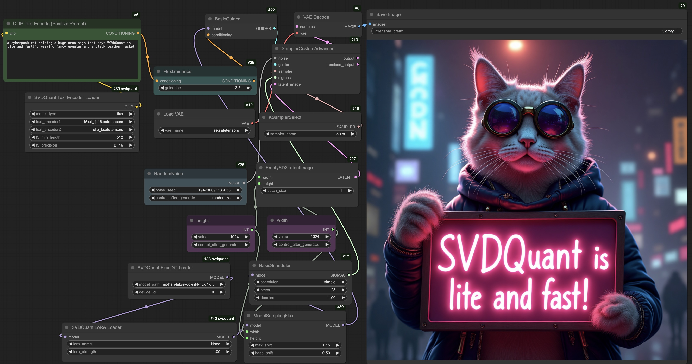

# SVDQuant ComfyUI Node


## Installation

1. Install `nunchaku` following [README.md](https://github.com/mit-han-lab/nunchaku?tab=readme-ov-file#installation). 
2. Set up the dependencies for [ComfyUI](https://github.com/comfyanonymous/ComfyUI/tree/master) with the following commands:

```shell
git clone https://github.com/comfyanonymous/ComfyUI.git
cd ComfyUI
pip install -r requirements.txt
```

## Usage

1. **Set Up ComfyUI and SVDQuant**:

  * Navigate to the root directory of ComfyUI and link (or copy) the [`nunchaku/comfyui`](./) folder to `custom_nodes/svdquant`.
  * Place the SVDQuant workflow configurations from [`workflows`](./workflows) into `user/default/workflows`.
  * For example

  ```shell
  # Clone repositories (skip if already cloned)
  git clone https://github.com/comfyanonymous/ComfyUI.git
  git clone https://github.com/mit-han-lab/nunchaku.git
  cd ComfyUI
  
  # Copy workflow configurations
  mkdir -p user/default/workflows
  cp ../nunchaku/comfyui/workflows/* user/default/workflows/
  
  # Add SVDQuant nodes
  cd custom_nodes
  ln -s ../../nunchaku/comfyui svdquant
  ```

2. **Download Required Models**: Follow [this tutorial](https://comfyanonymous.github.io/ComfyUI_examples/flux/) and download the required models into the appropriate directories using the commands below:

   ```shell
   huggingface-cli download comfyanonymous/flux_text_encoders clip_l.safetensors --local-dir models/clip
   huggingface-cli download comfyanonymous/flux_text_encoders t5xxl_fp16.safetensors --local-dir models/clip
   huggingface-cli download black-forest-labs/FLUX.1-schnell ae.safetensors --local-dir models/vae
   ```

3. **Run ComfyUI**: From ComfyUI’s root directory, execute the following command to start the application:

   ```shell
   python main.py
   ```

4. **Select the SVDQuant Workflow**: Choose one of the SVDQuant workflows (`flux.1-dev-svdquant.json` or `flux.1-schnell-svdquant.json`) to get started.

## SVDQuant Nodes

* **SVDQuant Flux DiT Loader**: A node for loading the FLUX diffusion model. 

  * `model_path`: Specifies the model location. It can be set to either `mit-han-lab/svdq-int-flux.1-schnell` or `mit-han-lab/svdq-int-flux.1-dev`. The model will automatically download from our Hugging Face repository.
  * `device_id`: Indicates the GPU ID for running the model.

* **SVDQuant LoRA Loader**: A node for loading LoRA modules for SVDQuant diffusion models.

  * Place your LoRA checkpoints in the `models/loras` directory. These will appear as selectable options under `lora_name`. **Ensure your LoRA checkpoints conform to the SVDQuant format. **A LoRA conversion script will be released soon. Meanwhile, example LoRAs are included and will automatically download from our Hugging Face repository when used.
  * **Note**: Currently, only **one LoRA** can be loaded at a time.

* **SVDQuant Text Encoder Loader**: A node for loading the text encoders.

  * For FLUX, use the following files:

    - `text_encoder1`: `t5xxl_fp16.safetensors`
    - `text_encoder2`: `clip_l.safetensors`
  
  * **`t5_min_length`**: Sets the minimum sequence length for T5 text embeddings. The default in `DualCLIPLoader` is hardcoded to 256, but for better image quality in SVDQuant, use 512 here.
  
  * **`t5_precision`**: Specifies the precision of the T5 text encoder. Choose `INT4` to use the INT4 text encoder, which reduces GPU memory usage by approximately 15GB. Please install [`deepcompressor`](https://github.com/mit-han-lab/deepcompressor) when using it:
  
    ```shell
    git clone https://github.com/mit-han-lab/deepcompressor
    cd deepcompressor
    pip install poetry
    poetry install
    ```
  
    
